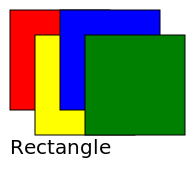
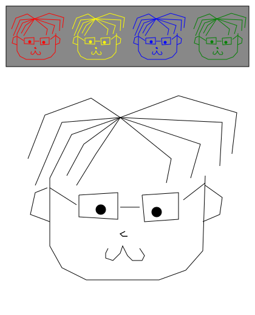

# Rectangle

Rectangle is a DSL for generating SVG image. You can use QML-like syntax to define graphic instances. And then output these instances in SVG format. In addition, you can use C-like syntax to define graphic components and reuse it in defining graphic instances.

## Example

### Graphic instance

The `Scene`, `Rectangle` and `Text` are all built-in components.

Rectangle input:

```
Scene {
    width: 175
    height: 150
    Rectangle {
        width: 100
        height: 100
        fill_color: "red"
    }
    Rectangle {
        x: 25
        y: 25
        width: 100
        height: 100
        fill_color: "yellow"
    }
    Rectangle {
        x: 50
        width: 100
        height: 100
        fill_color: "blue"
    }
    Rectangle {
        x: 75
        y: 25
        width: 100
        height: 100
        fill_color: "green"
    }
    Text {
        y: 125
        size: 20
        text: "Rectangle"
    }
}
```

SVG output:



### Graphic component

We can define a new graphic component `Fanlaoshi`, and use it in graphic instance.

Fanlaoshi.rect:

[Fanlaoshi.rect](./example/Fanlaoshi.rect)

FanlaoshiInstance.rect:

```
Scene {
    width: 400
    height: 500
    Rectangle {
        width: parent.width
        height: 100
        fill_color: "#888888"
    }
    Fanlaoshi {
        color: "red"
    }
    Fanlaoshi {
        x: 100
        color: "yellow"
    }
    Fanlaoshi {
        x: 200
        color: "blue"
    }
    Fanlaoshi {
        x: 300
        color: "green"
    }
    Fanlaoshi {
        y: 100
        width: 400
        height: 400
    }
}
```

SVG output:


